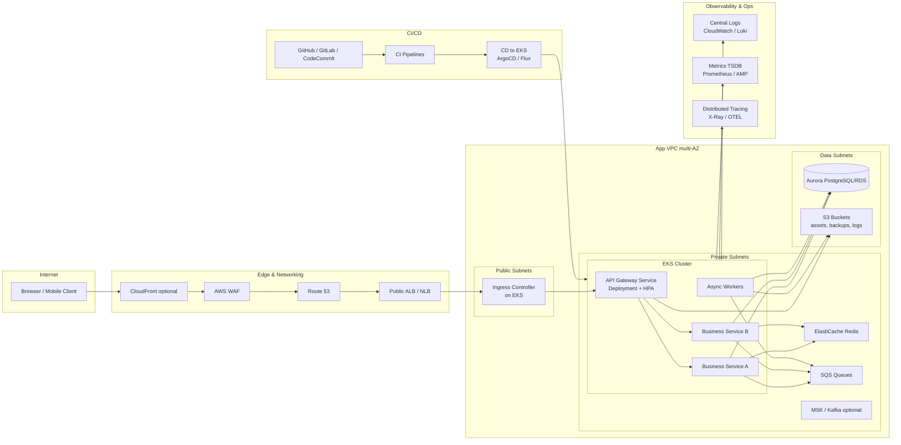

```mermaid
flowchart LR
  subgraph Internet
    U[Browser / Mobile Client]
  end

  subgraph Edge[Edge & Networking]
    CF[CloudFront optional]
    WAF[AWS WAF]
    ALB[Public ALB / NLB]
    R53[Route 53]
  end

  subgraph AppVPC[App VPC multi-AZ]
    subgraph PublicSubnets[Public Subnets]
      NGINX[Ingress Controller<br/>on EKS]
    end

    subgraph PrivateSubnets[Private Subnets]
      subgraph EKSCluster[EKS Cluster]
        API[API Gateway Service<br/>Deployment + HPA]
        SVC1[Business Service A]
        SVC2[Business Service B]
        WORK[Async Workers]
      end

      REDIS[ElastiCache Redis]
      SQS[SQS Queues]
      KAFKA[MSK / Kafka optional]
    end

    subgraph DataSubnets[Data Subnets]
      RDS[(Aurora PostgreSQL/RDS)]
      S3[S3 Buckets<br/>assets, backups, logs]
    end
  end

  subgraph Obs[Observability & Ops]
    LOKI[Central Logs<br/>CloudWatch / Loki]
    METRICS[Metrics TSDB<br/>Prometheus / AMP]
    TRACES[Distributed Tracing<br/>X-Ray / OTEL]
  end

  subgraph CICD[CI/CD]
    GIT[GitHub / GitLab / CodeCommit]
    CI[CI Pipelines]
    CD[CD to EKS<br/>ArgoCD / Flux]
  end

  U --> CF --> WAF --> R53 --> ALB --> NGINX
  NGINX --> API
  API --> SVC1
  API --> SVC2
  SVC1 --> SQS
  SVC2 --> SQS
  WORK --> SQS

  SVC1 --> RDS
  SVC2 --> RDS
  WORK --> RDS

  SVC1 --> REDIS
  SVC2 --> REDIS

  API --> S3
  WORK --> S3

  EKSCluster --> LOKI
  EKSCluster --> METRICS
  EKSCluster --> TRACES

  GIT --> CI --> CD --> EKSCluster
```
